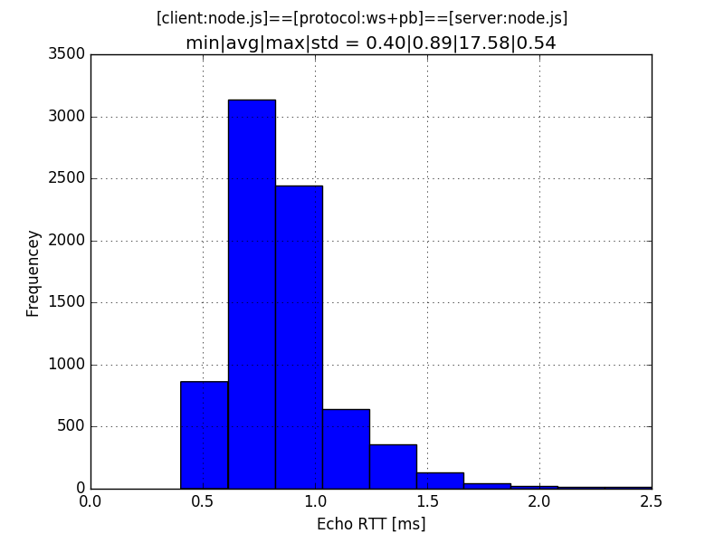

# RPC.js - An RPC solution for JavaScript

[ByteBuffer]: https://github.com/dcodeIO/bytebuffer.js/
[matplotlib]: http://matplotlib.org/
[Node.js]: http://nodejs.org/
[Protocol Buffers]: https://developers.google.com/protocol-buffers/
[Python]: https://www.python.org/
[Tornado]: http://www.tornadoweb.org/en/stable/
[ws]: https://www.npmjs.com/package/ws
[WebSockets]: http://www.html5rocks.com/en/tutorials/websockets/basics/

A research onto the behaviour of a lightweight RPC approach for JavaScript: The
system is made of two components - a client and a server - with the following
setup:

    [client: node.js] <=> [protocol: web-sockets+pb] <=> [server: node.js]

## Client: Node.js with ws

The client is an implementation in [Node.js] using the fast [ws] library for
[WebSockets]: It sends a short message (a timestamp) to the server. Since the 
latter reflects the message, it is immediately received back:

    [client: timestamp] => [server: echo] => [client: timestamp]

The durations between each reception of a message is measured with a resolution
of sub milli-seconds, and they are then reported continuously on the console.
 
## Protocol: WebSockets + Protocol Buffers

The binary [WebSockets] protocol is used for communication, where the client
connects to e.g. `ws://localhost:8088` and where the server listens accordingly
on the port `8088`.

Each timestamp value is packed within a *Timestamp* message using Google's
[Protocol Buffers] anguage-neutral and platform-neutral extensible mechanism for 
serializing structured data:

    message Timestamp {
        double value = 1;
    }

## Server: Node.js with ws

Upon receiving a message the server reflects it immediately back as it is,
without any further processing. It has also been implemented in [Node.js] with
again the [ws] library.

## Building the client/server

To build the server execute:

    make build-server

And to build the client execute:

    make build-client

## Running the client/server

To run the server execute:

    make run-server js

To run the client execute:

    make run-client js

## Performance

To analyse the time measurements done by client the console output needs to be
captured into a file:

    make run-client js | grep ^[0-9] > log/time-series.log

Then a corresponding histogram can be generated with:

    cat log/time-series.log | ./server/py/plot.py histogram

For the latter to work you need the [matplotlib] to be available with your
[Python] installation: An image with a name like `img-[...].png` should be
generated.

On a GNU/Linux system with a Intel Pentium CORE i5 processor you should get an
result like:

As you see the average RTT is about 0.89ms with a standard deviation of 0.54ms.

To gauge the robustness of the system, another server with CPython using the
[Tornado] has been tested, where these alternative implementation has produced
similar (but slightly slower) result.
