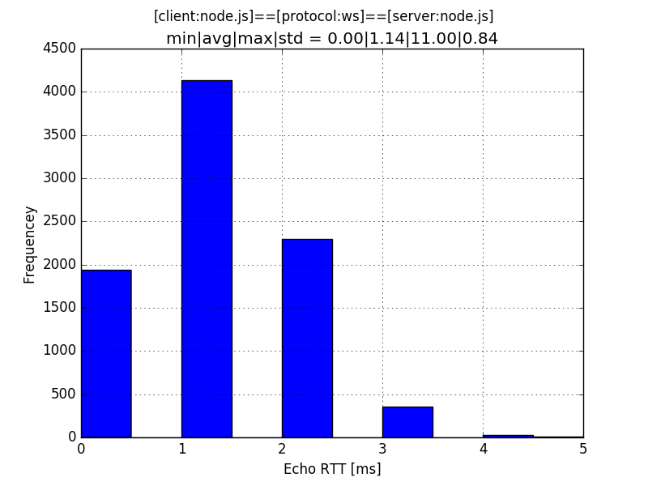

# RPC.js - An RPC solution for JavaScript

[Node.js]: http://nodejs.org/
[ws]: https://www.npmjs.com/package/ws
[WebSockets]: http://www.html5rocks.com/en/tutorials/websockets/basics/
[Python]: https://www.python.org/
[Tornado]: http://www.tornadoweb.org/en/stable/
[matplotlib]: http://matplotlib.org/
[PyPy]: http://pypy.org/

A research onto the behaviour of a lightweight RPC approach for JavaScript: The
system is made of two components - a client and a server - with the following
setup:

    [client: node.js] <=> [protocol: web-sockets] <=> [server: python]

## Client: Node.js with ws

The client is an implementation in [Node.js] using the fast [ws] library for
[WebSockets]: It sends a short message (a single dot character) to the server.
Since the server reflects the message, the same message is immediately received
back:

    [client: message] => [server: echo] => [client: same message]

The durations between each reception of a message is measured with a resolution
of milli-seconds, and they are then reported continuously on the console.
 
## Protocol: WebSockets 

The [WebSockets] protocol is used for communication, where the client connects
to e.g. `ws://localhost:8088` and where the server listens accordingly on the
port `8088`.

Using this example, the client-server system ends up being an experiment to
measure the performance capacity of WebSockets on a local system.

## Server: Node.js with ws

Upon receiving a message the server reflects it immediately back as it is,
without any further processing. It has been implemented using [Node.js] with
again [ws].

## Building the client/server

To build the server execute:

    make build-server

And to build the client execute:

    make build-client

## Running the client/server

To run the server execute:

    make run-server js

To run the client execute:

    make run-client js

## Performance

To analyse the time measurements done by client the console output needs to be
captured into a file:

    make run-client js | grep ^[0-9] > log/statistics.log

Then a corresponding histogram can be generated with:

    cat log/statistics.log | ./server/py/plot.py histogram

For the latter to work you need the [matplotlib] to be available with your
[Python] installation: An image with a name like `img-[...].png` should be
generated.

On a GNU/Linux system with a Intel Pentium CORE i5 processor you should get an
image like:

As you see the average RTT is about 1.14ms with a standard deviation of 0.84ms.

To gauge the robustness of the system depending on various parts of the test,
another server with CPython and [PyPy] (both with [Tornado]) has been tested,
where these alternative implementation have produced similar results.
